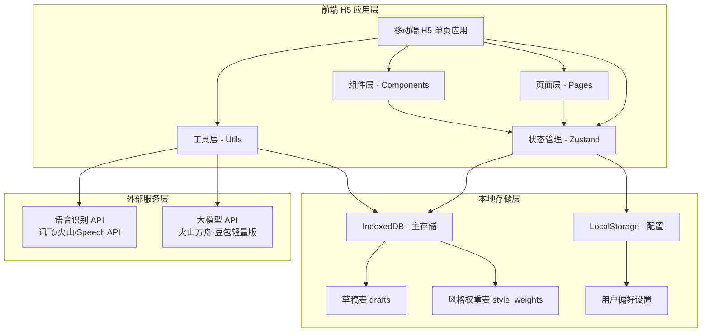
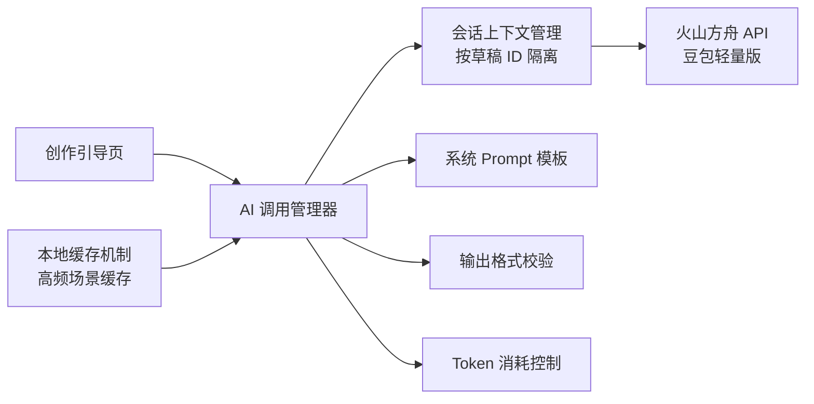

# 烟火诗笺 技术架构文档 V1.2

## 1. 架构设计



## 2. 技术选型说明

| 层级 | 技术方案 | 选型理由 |
|------|----------|----------|
| **前端框架** | React 18 + TypeScript | 组件化开发、类型安全、生态成熟，适配 H5 单页应用 |
| **构建工具** | Vite 5 | 启动快、热更新流畅，移动端调试体验好 |
| **样式方案** | Tailwind CSS 3 | 原子化 CSS、快速迭代、移动端适配便捷 |
| **状态管理** | Zustand | 轻量、简单、无 boilerplate，适配中小型应用 |
| **本地数据库** | IndexedDB (idb 库) | 大容量结构化存储，支持草稿、作品、交互历史的持久化 |
| **路由管理** | React Router v6 | 标准 SPA 路由方案，支持多页面切换 |
| **语音识别** | 浏览器 Speech API + 讯飞/火山 API | 浏览器 API 兜底，云端 API 提升方言识别准确率 |
| **大模型服务** | 火山方舟·豆包轻量版 API | 中文生活化场景理解精准，口语化输入适配好，免费额度充足 |
| **图标库** | lucide-react | 轻量、现代化、风格统一的图标库 |

### 2.1 为什么是纯前端

本产品 MVP 版本为纯前端 H5 应用，无后端服务，原因如下：
- **隐私优先**：所有创作数据存储在用户本地，不上传服务器，保障隐私安全
- **免账号化**：无需注册登录，打开即用，降低使用门槛
- **离线可用**：核心功能（录入、编辑、查看）完全离线可用，仅 AI 启发需联网
- **成本最低**：个人单用户场景下，第三方 API 免费额度完全覆盖，几乎零成本
- **快速迭代**：纯前端开发部署简单，验证需求阶段快速试错

## 3. 路由定义

| 路由路径 | 页面名称 | 功能描述 |
|----------|----------|----------|
| `/` | 首页（灵感捕捉页） | 超大录音按钮、文字新建入口、我的诗集入口 |
| `/voice-input` | 语音输入页 | 录音、语音转写、识别结果编辑确认 |
| `/text-input` | 文字输入页 | 文字/手写输入、实时保存、进入创作引导 |
| `/creation/:draftId` | 创作引导页 | 感受确认、3选项启发、步进深化、诗句采纳、我的诗稿 |
| `/poems` | 我的诗集页 | 草稿/已完成分类、作品列表、删除、备份入口 |
| `/poem/:draftId` | 作品详情/编辑页 | 作品编辑、标记完成、导出文本 |

## 4. 数据模型

### 4.1 核心数据结构（草稿表 drafts）

```typescript
interface Draft {
  draftId: string;          // 草稿唯一 ID
  title: string;            // 草稿标题（默认取灵感原文首句）
  inspirationText: string;  // 灵感原文（输入还原后内容，永久留存）
  poemLines: string[];      // 我的诗稿 - 已采纳的诗句列表
  chatHistory: ChatMessage[]; // 交互历史
  status: 'draft' | 'finished'; // 状态
  styleWeight: StyleWeight; // 该草稿对应的风格权重
  createdAt: number;        // 创建时间戳
  updatedAt: number;        // 最后编辑时间戳
}

interface ChatMessage {
  id: string;
  role: 'user' | 'assistant';
  content: string;
  timestamp: number;
  type?: 'inspiration' | 'confirmation' | 'options' | 'deepening';
}

interface StyleWeight {
  preferredWords: Record<string, number>;
  preferredThemes: Record<string, number>;
  likeCount: number;
  dislikeCount: number;
}
```

### 4.2 配置数据（LocalStorage）

```typescript
interface AppConfig {
  activeDraftId: string | null;  // 当前活跃草稿 ID
  inputMode: 'voice' | 'text';   // 默认输入方式
  fontSize: 'normal' | 'large';  // 字体大小设置
  apiKey: string | null;         // 豆包 API Key（本地存储）
  voiceApiProvider: 'xfyun' | 'volcengine' | 'browser'; // 语音识别服务商
}
```

## 5. AI 服务集成架构



### 5.1 AI 调用策略

1. **按需触发**：仅用户主动点击时调用，非实时生成
2. **会话隔离**：每个草稿独立会话上下文
3. **上下文精简**：仅携带最近 2 轮交互 + 灵感原文
4. **输出限长**：单次输出 ≤100 字
5. **本地缓存**：高频场景启发结果本地缓存

## 6. 项目目录结构

```
src/
├── components/           # 通用组件
│   ├── VoiceButton.tsx   # 录音按钮组件
│   ├── WaveAnimation.tsx # 声波动画组件
│   ├── PoemCard.tsx      # 作品卡片组件
│   ├── OptionItem.tsx    # 启发选项组件
│   └── PoemEditor.tsx    # 诗稿编辑器组件
├── pages/                # 页面组件
│   ├── HomePage.tsx      # 首页
│   ├── VoiceInputPage.tsx # 语音输入页
│   ├── TextInputPage.tsx  # 文字输入页
│   ├── CreationPage.tsx   # 创作引导页
│   ├── PoemsPage.tsx      # 我的诗集页
│   └── PoemDetailPage.tsx # 作品详情页
├── store/                # 状态管理
│   ├── useDraftStore.ts  # 草稿状态
│   └── useConfigStore.ts # 配置状态
├── utils/                # 工具函数
│   ├── db.ts             # IndexedDB 封装
│   ├── ai.ts             # AI API 调用
│   ├── voice.ts          # 语音识别封装
│   ├── prompt.ts         # 系统 Prompt 模板
│   └── export.ts         # 导出工具
├── types/                # TypeScript 类型定义
│   └── index.ts
├── App.tsx               # 应用根组件
├── main.tsx              # 入口文件
└── index.css             # 全局样式
```

## 7. 设计规范

### 7.1 色彩系统

| 色彩变量 | 色值 | 用途 |
|----------|------|------|
| 主色调 - 暖橙 | #F59E0B | 录音按钮、主操作按钮、强调元素 |
| 背景色 - 暖米白 | #FFFBF5 | 页面背景、卡片底色 |
| 文字色 - 深棕 | #3D2C1E | 主要文字内容 |
| 文字色 - 浅棕 | #786B5E | 次要文字、辅助说明 |
| 分割线 - 浅米色 | #EFE5D8 | 分割线、边框 |
| 成功色 - 橄榄绿 | #6B8E23 | 已采纳、完成状态 |
| 反馈色 - 柔和红 | #D47766 | 删除、警示 |

### 7.2 字体规范

- **标题字体**："Noto Serif SC", serif（思源宋体，增加诗意感）
- **正文字体**："Noto Sans SC", sans-serif（思源黑体，保证可读性）
- 基础字号：16px
- 标题字号：20px - 24px
- 辅助文字：13px - 14px

### 7.3 交互规范

- 核心按钮尺寸：≥48px × 48px
- 页面过渡动画：200ms - 300ms ease
- 按压反馈：按钮下沉 + 轻微缩放
- 列表项：左滑删除、点击进入详情
